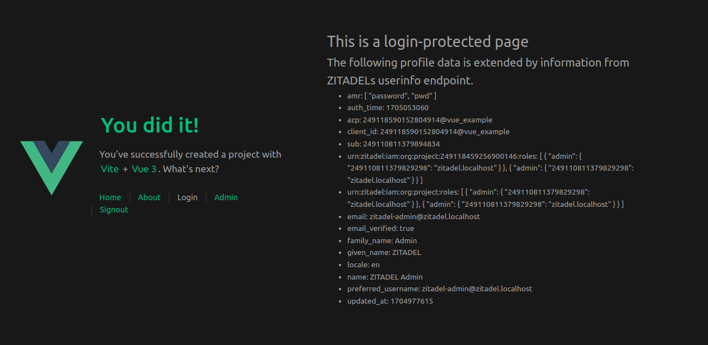

# @zitadel/vue Example

Authenticate your [ZITADEL](https://zitadel.com) users within your Vue applications.


[](https://makeapullrequest.com)

> [!IMPORTANT]
> If you want to try out [@zitadel/vue](https://www.npmjs.com/package/@zitadel/vue), read the [ZITADEL step-by-step guide for Vue](https://zitadel.com/docs/examples/login/vue).
> It shows how to get the *client_id* and the *project_resource_id* from ZITADEL and how to wire everything up in Vue.

## Project Structure

The example project is generated in the repositories root directory using [Vite](https://vitejs.dev/guide/#scaffolding-your-first-vite-project).

The following pages are added to the scaffolded example application:
- *src/views/LoginView.vue*: The protected login page shows the information retrieved from ZITADEL when a user is authenticated.
- *src/views/AdminView.vue*: The protected admin page renders different views depending on if the user has the role "admin" or not.
- *src/views/CallbackView.vue*: Handles the OIDC redirect callback at `/auth/callback` and routes back to the originally requested page.



The following files are added or modified to enable ZITADEL authentication:
- *src/router/index.ts*: Routes are protected using `meta: { requiresAuth: true }` and `zitadelAuth.useRouter(router)`.
- *src/App.vue*: The navigation bar is conditionally rendered depending on the authentication state.
- *src/services/zitadelAuth.ts*: The [@zitadel/vue SDK](https://www.npmjs.com/package/@zitadel/vue) is configured.
- *src/main.ts*: The Vue application is bootstrapped with ZITADEL auth support and `$zitadel` is exposed as a global property.
- The folder *./lib* contains the [@zitadel/vue SDK](https://www.npmjs.com/package/@zitadel/vue).

## Features

The NPM package [@zitadel/vue](https://www.npmjs.com/package/@zitadel/vue) is a thin Vue wrapper around the actively maintained [oidc-client-ts](https://github.com/authts/oidc-client-ts) library.

- Reactive auth state (`isAuthenticated`, `user`, `userProfile`) backed by Vue's `reactive()`.
- Sensible defaults for ZITADEL: PKCE code flow, automatic silent renewal, user info enrichment.
- Role checks via `hasRole(role)` against the project roles claim.
- A drop-in `vue-router` navigation guard via `useRouter(router)` that redirects unauthenticated users for routes with `meta.requiresAuth`.

The following is an example for a minimal OIDC configuration:

```typescript
import { createZITADELAuth } from "@zitadel/vue";

const zitadelAuth = createZITADELAuth({
  issuer: `${myZITADELInstancesOrigin}`,
  client_id: `${myApplicationsClientID}`,
  project_resource_id: `${myApplicationsProjectResourceID}`,
  org_id: `${myApplicationsOrganizationID}`, // optional
});
```

The following defaults apply:
- The OIDC Code Flow with PKCE is used for authentication at ZITADEL.
- ZITADELs user info endpoint is called to enrich the user profile.
- The access token is refreshed automatically by default before it expires.
- If you specify a *project_resource_id*, the scopes for retrieving the users roles from the user info endpoint are added automatically.
You can conveniently use `zitadelAuth.hasRole("someRoleKey")`.

Optional:
- add an *org_id* to register and login users directly in the organization scope.
- pass a second argument to `createZITADELAuth` to override any [`UserManagerSettings`](https://authts.github.io/oidc-client-ts/interfaces/UserManagerSettings.html) from `oidc-client-ts`.

### API

```typescript
interface ZITADELAuth {
  readonly userManager: UserManager;     // the underlying oidc-client-ts UserManager
  readonly isAuthenticated: boolean;     // reactive
  readonly user: User | null;            // reactive
  readonly userProfile: Record<string, unknown>; // reactive — id_token claims
  signIn(): Promise<void>;               // calls signinRedirect
  signOut(): Promise<void>;              // calls signoutRedirect
  hasRole(role: string): boolean;        // checks the project roles claim
  useRouter(router: Router): void;       // installs a beforeEach navigation guard
}

// Helpers exported alongside createZITADELAuth:
function handleCallback(auth: ZITADELAuth): Promise<User>;       // call from /auth/callback
function handleSignoutCallback(auth: ZITADELAuth): Promise<void>;
function startup(auth: ZITADELAuth): Promise<boolean>;           // restore user on app boot
```

## Running the Example

### Recommended IDE Setup

[VSCode](https://code.visualstudio.com/) + [Volar](https://marketplace.visualstudio.com/items?itemName=Vue.volar) (and disable Vetur) + [TypeScript Vue Plugin (Volar)](https://marketplace.visualstudio.com/items?itemName=Vue.vscode-typescript-vue-plugin).

### Type Support for `.vue` Imports in TS

TypeScript cannot handle type information for `.vue` imports by default, so we replace the `tsc` CLI with `vue-tsc` for type checking. In editors, we need [TypeScript Vue Plugin (Volar)](https://marketplace.visualstudio.com/items?itemName=Vue.vscode-typescript-vue-plugin) to make the TypeScript language service aware of `.vue` types.

### Customize configuration

See [Vite Configuration Reference](https://vitejs.dev/config/).

### Project Setup

```sh
npm install
```

#### Compile and Hot-Reload for Development

```sh
npm run dev
```

#### Type-Check, Compile and Minify for Production

```sh
npm run build
```

#### Lint with [ESLint](https://eslint.org/)

```sh
npm run lint
```
